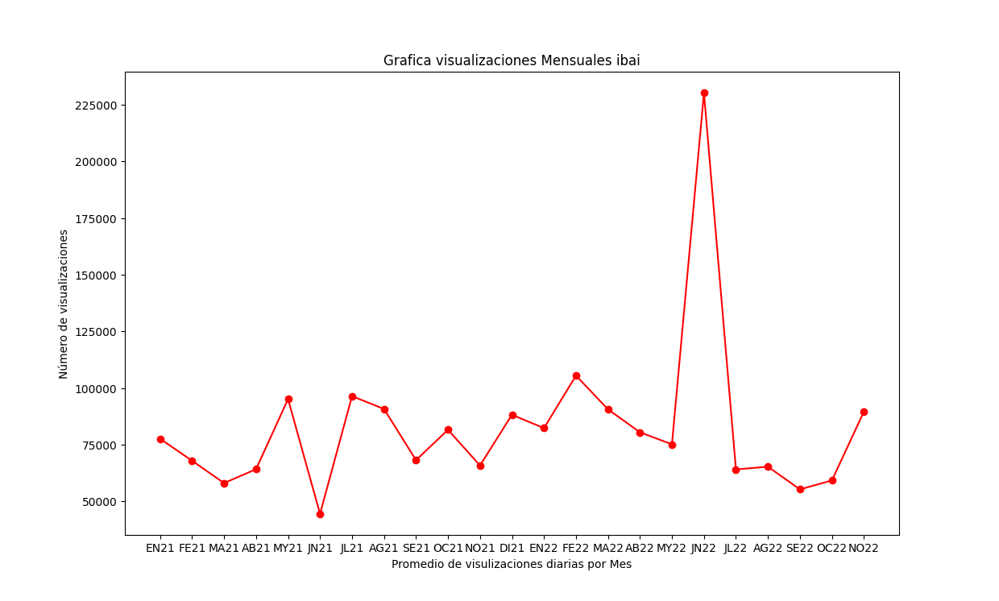

## GRRAFICA DE VISUALIZACION DE DATOS DEL STREAMER DE TWICH,IBAI

#### Autor
  Jorge Humberto Bolaños Ruiz
#### información de contacto
  Correo electronico: Jorgehbr101@gmail.com
## información para instalación y ejecución
#### Se debe instalar Matplotlib
  Para usuarios de Conda:
  
  Si desea que la instalación se realice a través de conda, puede usar el siguiente comando: 

      conda install matplotlib
      
  Escriba y para aceptar cuando se le solicite
  
  Recibirá un mensaje similar una vez que se complete la instalación
  
    "installing Matplotlib using conda"
    
  Asegúrese de seguir las mejores prácticas para la instalación usando conda como:

  Utilice un entorno para la instalación en lugar del entorno base mediante el siguiente comando:
  
    conda create -n my-env
    
    conda activate my-env
    
    
 Nota: Si su método de instalación preferido es conda-forge, use el siguiente comando:
  
    conda config --env --add channels conda-forge
    
For PIP Users:
    
Users who prefer to use pip can use the below command to install Matplotlib:

      pip install matplotlib

## introducción
Esta grafica nos refleja el nivel de visulizaciones en promedio por mes que ha tenido uno de los más grandes streamers de twich a día de hoy, entre 2021 y noviembre
del 2022, lo que nos permite visualizar y ver, en lo picos loss meses en que ha habiedo eventos masivos en los que mucha gente entra a ver lo que sucede

## Resultados

## conclusiones y bibliografía.
Podemos ver que se puede apreciar claramente el mes en el que hubo el evento más garnde de su canal en desde el inicio del 2021 hasta Noviembre del presente 2022

Los datos para esta grafica, fueron obtenidos de:

    https://twitchtracker.com/ibai/statistics

